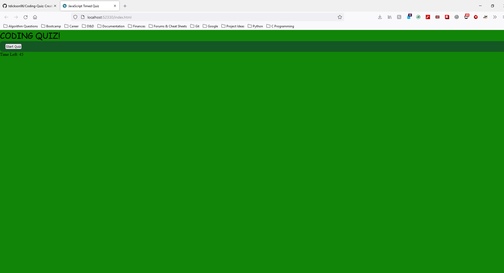
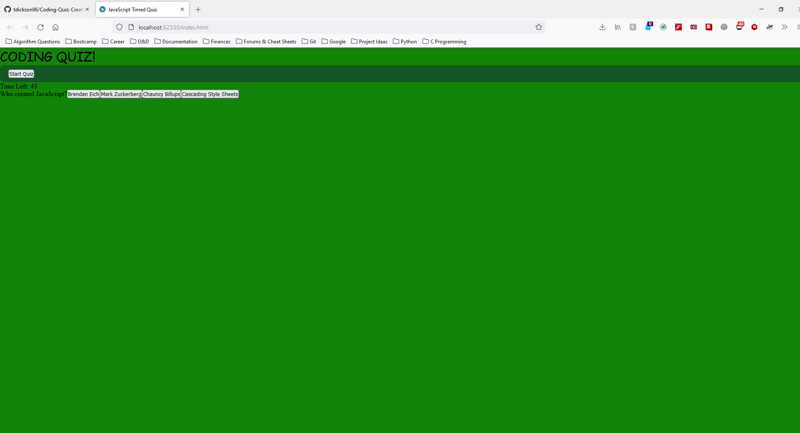
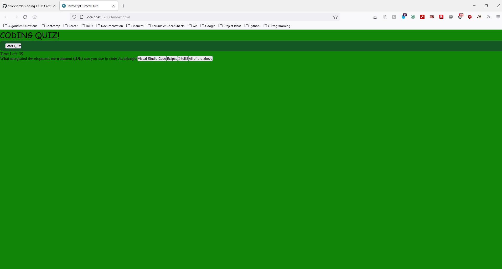
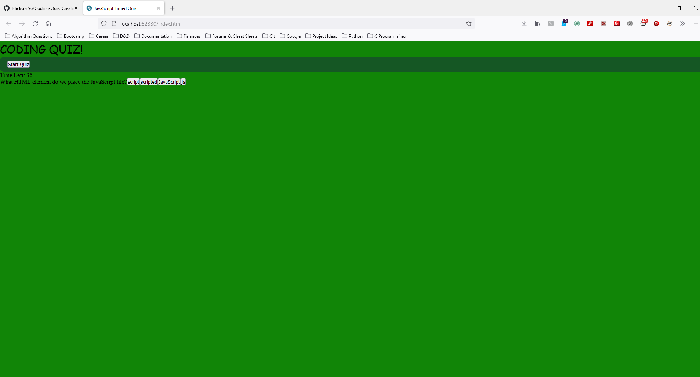
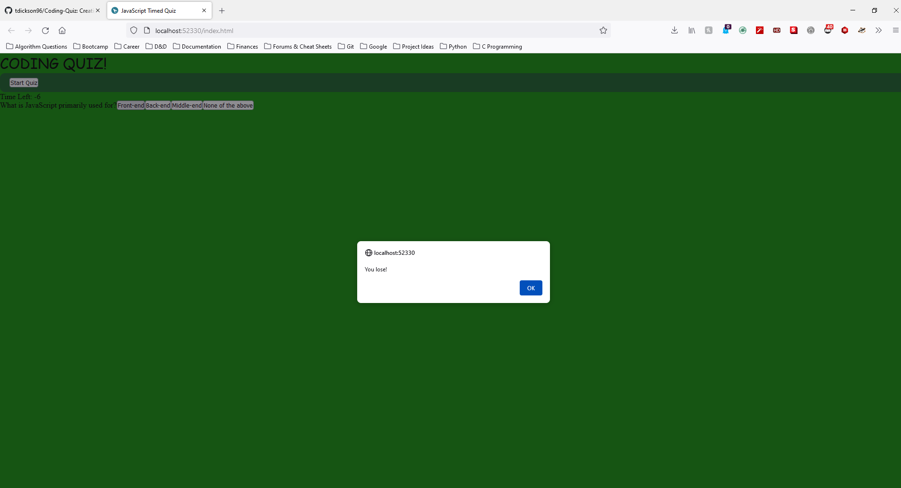

# JavaScript Timed Quiz

## Deployment and Repository

GitHub Pages DEPLOYED: https://tdickson96.github.io/Coding-Quiz/ 

GitHub REPOSITORY: https://github.com/tdickson96/Coding-Quiz

## Description

Client was looking for a timed quiz to practice JavaScript knowledge questions. The following HTML, CSS and JS files utilize event listeners, timer intervals, DOM traversal, and other variables to produce one question at a time with four options and only one correct answer. If the quiz taker fails a question, then the quiz loses 5 seconds of time. The quiz ends if the time runs out or all questions are answered. The user is then prompted with a leaderboards to display their initials and quiz score. 

## Usage

## Credits
Trent Dickson
Godfrey Best
- - -
© 2022 Trilogy Education Services, LLC, a 2U, Inc. brand. Confidential and Proprietary. All Rights Reserved.
